``` r
library(stringr)
library(ggplot2)
library(FactoMineR)
library(factoextra)
```

    ## Welcome! Want to learn more? See two factoextra-related books at https://goo.gl/ve3WBa

``` r
library(reshape)
library(reshape2)
```

    ## 
    ## Attaching package: 'reshape2'

    ## The following objects are masked from 'package:reshape':
    ## 
    ##     colsplit, melt, recast

``` r
library(gplots)
```

    ## 
    ## Attaching package: 'gplots'

    ## The following object is masked from 'package:stats':
    ## 
    ##     lowess

``` r
library(RColorBrewer)
library(dplyr)
```

    ## 
    ## Attaching package: 'dplyr'

    ## The following object is masked from 'package:reshape':
    ## 
    ##     rename

    ## The following objects are masked from 'package:stats':
    ## 
    ##     filter, lag

    ## The following objects are masked from 'package:base':
    ## 
    ##     intersect, setdiff, setequal, union

``` r
library(tidyr)
```

    ## 
    ## Attaching package: 'tidyr'

    ## The following object is masked from 'package:reshape2':
    ## 
    ##     smiths

    ## The following objects are masked from 'package:reshape':
    ## 
    ##     expand, smiths

``` r
library(ggpubr)
library (ANCOMBC)
library(vegan)
```

    ## Loading required package: permute

    ## Loading required package: lattice

    ## This is vegan 2.6-4

``` r
library(purrr)
library(ggrepel)
```

### Theme function definitions

``` r
theme_boxp <- function(){
  
  font <- "Times New Roman"
  
  theme_minimal() %+replace%
    
    theme(axis.title.y = element_text(angle = 90, size = 10), 
          axis.title.x = element_blank(),   
          axis.text.x = element_text(angle = 45, size = 10, color = "black"), 
          axis.text.y = element_text(size = 10, color = "black"), 
          
          panel.background = element_rect(fill = "white"),  
          axis.line.x = element_line(color = "black"), 
          axis.line.y = element_line(color = "black"), 
          
          legend.text = element_text(size = 10, lineheight = 0.6), 
          legend.spacing.y = unit(0.6, "mm"), 
          legend.key.height = unit(2, "mm"), 
          legend.key=element_rect(fill="white", color="black", linewidth = 0), 
          legend.title = element_blank(), 
          strip.background = element_rect(fill = NA, linetype = "solid", size = 1, colour = "black"), 
          strip.text = element_text(size = 10, margin = margin(1,1,1,1)), 
          panel.border = element_rect(fill = NA, size = 1),
          panel.spacing.y = unit(1,"line"),
    )
}

theme_pca <- function(){
  
  font <- "Times New Roman"
  
  theme_boxp() %+replace%
    
    theme(legend.position = "none", 
          axis.title.y = element_text(angle = 90, size = 12, color = "black"),
          axis.title.x = element_text(size = 12, color = "black"),
          axis.text.x = element_text(size = 10), 
          axis.text.y = element_text(size = 10),
          )
}

reg_eq <- function(x,y) {
  m <- lm(y ~ x)
  as.character(
    as.expression(
      substitute(italic(y) == a + b %.% italic(x)*","~~italic(r)^2~"="~r2,
                list(a = format(coef(m)[1], digits = 4),
                b = format(coef(m)[2], digits = 4),
                r2 = format(summary(m)$r.squared, digits = 3)))
    )
  )
}
```

### Defining figure color vectors

``` r
vec_col_patients <- c( "midnightblue", 
               "yellow3",  "forestgreen", "chocolate", "plum", "cornflowerblue")

vec_col_type <- c( "darkgoldenrod1", "blue4")


family_cols <- c("Bacteroidaceae"="cyan3", "Prevotellaceae"="coral", "Verrucomicrobiaceae"="#1B9E77", "Porphyromonadaceae"="#B16548", "Lachnospiraceae"="#8068AE", "Rikenellaceae"="#D03792", "Ruminococcaceae"="#A66753", "Muribaculaceae"="#666666", "Alcaligenaceae"="#D9AA04", "Erysipelotrichaceae"="tomato4", "Clostridiaceae"="#927132", "Enterobacteriaceae"="#7FA718", "Veillonellaceae"="#BC4399", "Pseudomonadaceae"="#9D7426", "other"="grey")
```

### Importing Metadata file

``` r
metadata <- read.delim("/media/deepan/Deepan/RA_Bottini/sample-metadata-wflownumbers.tsv", header = TRUE, sep = "\t", check.names = FALSE)[-1,]
```

### Generating PCA plots from imported phylo-RPCA, unweighted unifrac and jaccard distance matrices generated with QIIME2 (Bolyen et al., 2019)

``` r
phylo_rpca <- read.delim("/media/deepan/Deepan/RA_Bottini/final_merged_tables_forwardonly_andfecalog/phylo-ordination_nobeforeFMT/ordination_coords.csv", header = TRUE, sep = "\t", check.names = FALSE)#only plotting PC1 and PC2. 

phylo_rpca <-  merge(phylo_rpca, metadata, by = "sample-ID", all.y = FALSE)

ggplot(phylo_rpca, aes(x = PC1, y = PC2, fill = Patient, shape = OriginalFecal)) +
  geom_hline(yintercept = 0, linetype = "dashed", color = "black") +
  geom_vline(xintercept = 0, linetype = "dashed", color = "black") +
  geom_point(size = 4) +
  stat_ellipse(level = 0.95, geom = "polygon", alpha = 0.4) +
  scale_shape_manual(values = c(21, 23)) +
  scale_fill_manual(values = rev(vec_col_patients)) +
  labs(x = "PC1 (66.15%)", y = "PC2 (33.34%)") +
  theme_pca()
```

    ## Warning: The `size` argument of `element_rect()` is deprecated as of ggplot2 3.4.0.
    ## ℹ Please use the `linewidth` argument instead.
    ## This warning is displayed once every 8 hours.
    ## Call `lifecycle::last_lifecycle_warnings()` to see where this warning was
    ## generated.

    ## Too few points to calculate an ellipse
    ## Too few points to calculate an ellipse
    ## Too few points to calculate an ellipse
    ## Too few points to calculate an ellipse
    ## Too few points to calculate an ellipse
    ## Too few points to calculate an ellipse

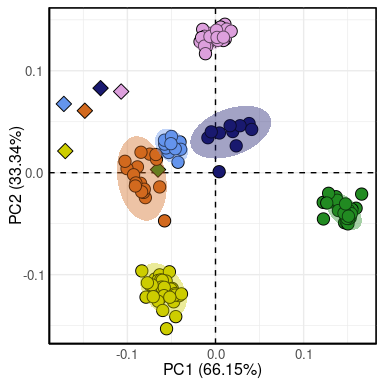<!-- -->

``` r


ggplot(phylo_rpca, aes(x = PC1, y = PC2, fill = MouseType, shape = OriginalFecal)) +
  geom_hline(yintercept = 0, linetype = "dashed", color = "black") +
  geom_vline(xintercept = 0, linetype = "dashed", color = "black") +
  geom_point(size = 4) +
  stat_ellipse(level = 0.95, geom = "polygon", alpha = 0.4) +
  scale_shape_manual(values = c(21, 23)) +
  scale_fill_manual(values = c("grey", rev(vec_col_type))) +
  labs(x = "PC1 (66.15%)", y = "PC2 (33.34%)") +
  theme_pca()
```

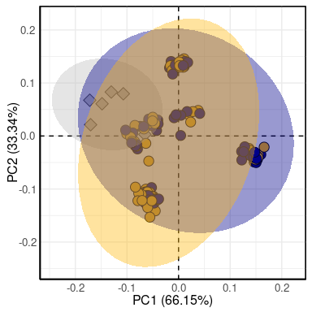<!-- -->

``` r


ggplot(phylo_rpca, aes(x = PC1, y = PC2, fill = BeforeAfterArthritisInd, shape = OriginalFecal)) +
  geom_hline(yintercept = 0, linetype = "dashed", color = "black") +
  geom_vline(xintercept = 0, linetype = "dashed", color = "black") +
  geom_point(size = 4) +
  stat_ellipse(level = 0.95, geom = "polygon", alpha = 0.4) +
  scale_shape_manual(values = c(21, 23)) +
  scale_fill_manual(values = c("grey", "tomato4", "cornflowerblue")) +
  labs(x = "PC1 (66.15%)", y = "PC2 (33.34%)") +
  theme_pca()
```

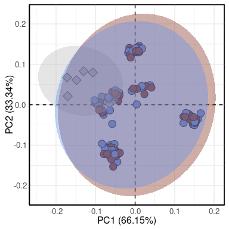<!-- -->

``` r


uunifrac <- read.delim("/media/deepan/Deepan/RA_Bottini/final_merged_tables_forwardonly_andfecalog/core-metrics-result-nobeforeFMT/unweighted_unifrac_pcoa_results/ordination_coords.csv", header = TRUE, sep = "\t", check.names = FALSE)#only plotting PC1 and PC2. 

uunifrac <-  merge(uunifrac, metadata, by = "sample-ID", all.y = FALSE)


ggplot(uunifrac, aes(x = PC1, y = PC2, fill = Patient, shape = OriginalFecal)) +
  geom_hline(yintercept = 0, linetype = "dashed", color = "black") +
  geom_vline(xintercept = 0, linetype = "dashed", color = "black") +
  geom_point(size = 4) +
  stat_ellipse(level = 0.95, geom = "polygon", alpha = 0.4) +
  scale_shape_manual(values = c(21, 23)) +
  scale_fill_manual(values = rev(vec_col_patients)) +
  labs(x = "PC1 (28.73%)", y = "PC2 (13.02%)") +
  theme_pca()
```

    ## Too few points to calculate an ellipse
    ## Too few points to calculate an ellipse
    ## Too few points to calculate an ellipse
    ## Too few points to calculate an ellipse
    ## Too few points to calculate an ellipse
    ## Too few points to calculate an ellipse

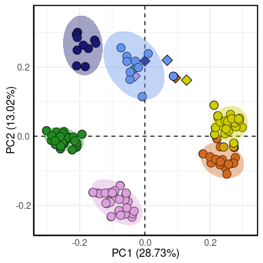<!-- -->

``` r


ggplot(uunifrac, aes(x = PC1, y = PC2, fill = MouseType, shape = OriginalFecal)) +
  geom_hline(yintercept = 0, linetype = "dashed", color = "black") +
  geom_vline(xintercept = 0, linetype = "dashed", color = "black") +
  geom_point(size = 4) +
  stat_ellipse(level = 0.95, geom = "polygon", alpha = 0.4) +
  scale_shape_manual(values = c(21, 23)) +
  scale_fill_manual(values =  c("grey", rev(vec_col_type))) +
  labs(x = "PC1 (28.73%)", y = "PC2 (13.02%)") +
  theme_pca()
```

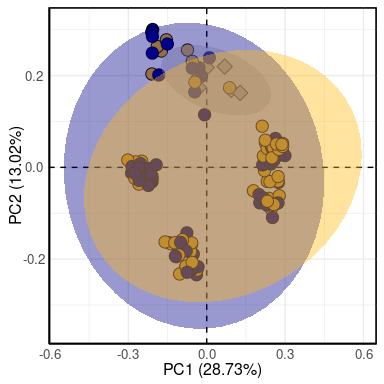<!-- -->

``` r


ggplot(uunifrac, aes(x = PC1, y = PC2, fill = BeforeAfterArthritisInd, shape = OriginalFecal)) +
  geom_hline(yintercept = 0, linetype = "dashed", color = "black") +
  geom_vline(xintercept = 0, linetype = "dashed", color = "black") +
  geom_point(size = 4) +
  stat_ellipse(level = 0.95, geom = "polygon", alpha = 0.4) +
  scale_shape_manual(values = c(21, 23)) +
  scale_fill_manual(values = c("grey", "tomato4", "cornflowerblue")) +
  labs(x = "PC1 (28.73%)", y = "PC2 (13.02%)") +
  theme_pca()
```

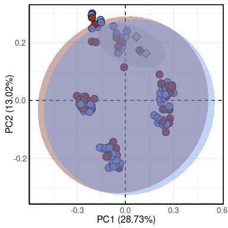<!-- -->

``` r


jacc <- read.delim("/media/deepan/Deepan/RA_Bottini/final_merged_tables_forwardonly_andfecalog/core-metrics-result-nobeforeFMT/jaccard_pcoa_results/ordination_coords.csv", header = TRUE, sep = "\t", check.names = FALSE)#only plotting PC1 and PC2. 

jacc <-  merge(jacc, metadata, by = "sample-ID", all.y = FALSE)


ggplot(jacc, aes(x = PC1, y = PC2, fill = Patient, shape = OriginalFecal)) +
  geom_hline(yintercept = 0, linetype = "dashed", color = "black") +
  geom_vline(xintercept = 0, linetype = "dashed", color = "black") +
  geom_point(size = 4) +
  stat_ellipse(level = 0.95, geom = "polygon", alpha = 0.4) +
  scale_shape_manual(values = c(21, 23)) +
  scale_fill_manual(values = rev(vec_col_patients)) +
  labs(x = "PC1 (20.91%)", y = "PC2 (17.2%)") +
  theme_pca()
```

    ## Too few points to calculate an ellipse
    ## Too few points to calculate an ellipse
    ## Too few points to calculate an ellipse
    ## Too few points to calculate an ellipse
    ## Too few points to calculate an ellipse
    ## Too few points to calculate an ellipse

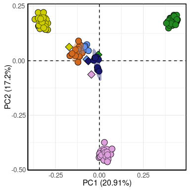<!-- -->

``` r

ggplot(jacc, aes(x = PC1, y = PC2, fill = MouseType, shape = OriginalFecal)) +
  geom_hline(yintercept = 0, linetype = "dashed", color = "black") +
  geom_vline(xintercept = 0, linetype = "dashed", color = "black") +
  geom_point(size = 4) +
  stat_ellipse(level = 0.95, geom = "polygon", alpha = 0.4) +
  scale_shape_manual(values = c(21, 23)) +
  scale_fill_manual(values =  c("grey", rev(vec_col_type))) +
  labs(x = "PC1 (20.91%)", y = "PC2 (17.2%)") +
  theme_pca()
```

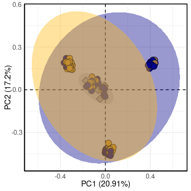<!-- -->

``` r

ggplot(jacc, aes(x = PC1, y = PC2, fill = BeforeAfterArthritisInd, shape = OriginalFecal)) +
 geom_hline(yintercept = 0, linetype = "dashed", color = "black") +
  geom_vline(xintercept = 0, linetype = "dashed", color = "black") +
  geom_point(size = 4) +
  stat_ellipse(level = 0.95, geom = "polygon", alpha = 0.4) +
  scale_shape_manual(values = c(21, 23)) +
  scale_fill_manual(values = c("grey", "tomato4", "cornflowerblue")) +
  labs(x = "PC1 (20.91%)", y = "PC2 (17.2%)") +
  theme_pca()
```

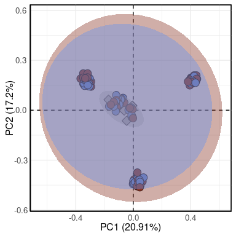<!-- -->

``` r

```

### Stacked barplots of original fecal samples family level

``` r
fecal <- as.data.frame(t(read.delim("/media/deepan/Deepan/RA_Bottini/fecal_samples/level-6.csv", header = TRUE, sep = ",", check.names = FALSE)))

colnames(fecal) <- fecal[1,]
fecal <- fecal[c(-1, -nrow(fecal)),]
fecal$Taxa <- rownames(fecal)
fecal <- fecal[, c(ncol(fecal), 1:(ncol(fecal)-1))]
rownames(fecal) <- c()
fecal[,2:ncol(fecal)] <- sapply(fecal[,2:ncol(fecal)], as.numeric)
colnames(fecal) <- c(colnames(fecal)[1], str_replace_all(colnames(fecal[,2:ncol(fecal)]), "RA0", "RA#"))

fecal <- fecal[, c(1, 7, 5, 4, 3, 6, 2)]

fecal$Taxa <- str_replace_all(fecal$Taxa, "\\[", "")
fecal$Taxa <- str_replace_all(fecal$Taxa, "\\]", "")

total_reads <- as.data.frame(apply(fecal[, -1], 2, sum))
colnames(total_reads) <- "total_reads"
total_reads$`sample-ID` <- rownames(total_reads)
ggplot(total_reads, aes(x = `sample-ID`, y = total_reads)) + geom_bar(stat = "identity", width = 0.8) + theme_boxp() + theme(axis.text.x = element_text(angle = 90))##checking  the total number of reads in each sample
```

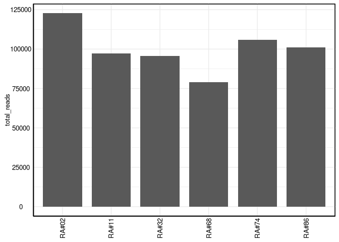<!-- -->

``` r
fecal$mean <- apply(fecal[,-1], 1, function(x) mean(x))
fecal <- fecal[order(fecal$mean, decreasing = TRUE),]

fecal <- fecal[fecal$mean > 2.5,]
fecal <- fecal[-nrow(fecal),]

fecal$final_tax <- str_split(str_split(fecal$Taxa, ";f__", simplify= TRUE)[,2], ";", simplify = TRUE)[,1]
fecal <- fecal[, c(1, ncol(fecal), 2:(ncol(fecal)-1))]

fecal <- fecal[, -ncol(fecal)]

fecal$final_tax[15:nrow(fecal)] <- "other"
fecal$final_tax <- str_replace(fecal$final_tax, "S24-7", "Muribaculaceae")

fecal_family <- aggregate(fecal[,c(-1, -2)], by = list(fecal$final_tax), sum)
fecal_family$Group.1 <- ordered(fecal_family$Group.1, levels = c(unique(fecal$final_tax)))

fecal$final_tax <- str_split(str_split(fecal$Taxa, ";g__", simplify= TRUE)[,2], ";", simplify = TRUE)[,1]
fecal$final_tax <- ifelse(fecal$final_tax == "", "other", fecal$final_tax)
fecal_genus <- aggregate(fecal[,c(-1, -2)], by = list(fecal$final_tax), sum)

fecal_genus[,-1] <- apply(fecal_genus[,-1], 2, function(x) x/sum(x))
```

### Generating patient fecal sample barplot (Main Fig 4d)

``` r

ggplot(melt(fecal_family), aes(x = variable, y = value, fill = Group.1)) + geom_bar(stat = "identity", position = "fill",width = 0.8) + 
  scale_fill_manual(values = family_cols) +
   theme(text = element_text(size = 15), axis.text.x = element_text(angle = 90)) + theme_boxp()
```

    ## Using Group.1 as id variables

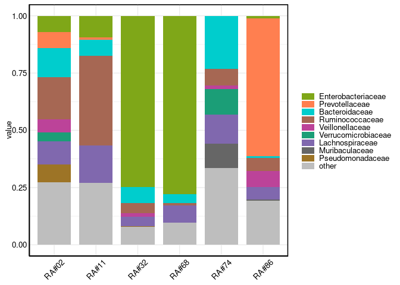<!-- -->

``` r

```

### Ratio of Prevotellaceae to Bacteroides (Main Fig 4e)

``` r
temp <- fecal_genus[str_detect(fecal_genus$Group.1, "Prevotella|Bacteroides"),]
#temp <- aggregate(temp[,c(-1, -2)], by = list(temp$final_tax), sum)


ggplot(melt(temp), aes(x = variable, y = value, fill = Group.1)) + geom_bar(stat = "identity",width = 0.8) + 
  scale_fill_manual(values = c("Bacteroides"="cyan3", "Prevotella"="coral")) +
  scale_y_continuous(limits = c(0, 1)) +
   theme_boxp() + theme(text = element_text(size = 15), axis.text.x = element_text(angle = 90), axis.title.y = element_blank(), legend.position = "none")
```

    ## Using Group.1 as id variables

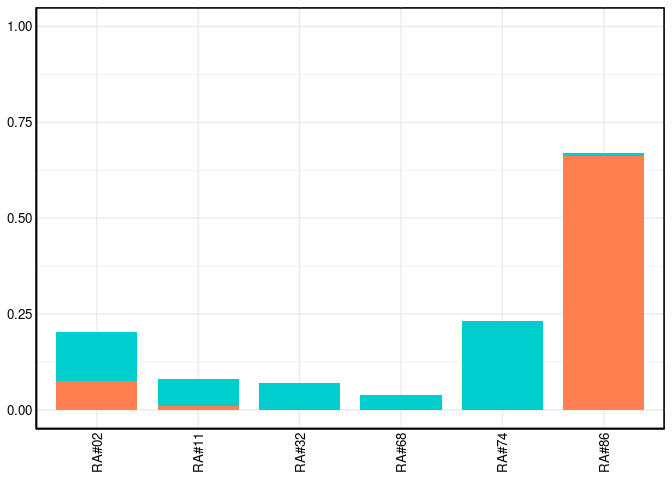<!-- -->

``` r

```

### Stacked barplots for all mice fecal samples

``` r
data <- as.data.frame(t(read.delim("/media/deepan/Deepan/RA_Bottini/final_merged_tables_forwardonly/level-6.csv", header = TRUE, sep = ",", check.names = FALSE)))[1:86,]
colnames(data) <- data[1,]
data <- data[-1,]
data$Taxa <- rownames(data)
data <- data[, c(ncol(data), 1:(ncol(data)-1))]
rownames(data) <- c()
data[,2:ncol(data)] <- sapply(data[,2:ncol(data)], as.numeric)

```

    ##                                                                                            Taxa
    ## 62 k__Bacteria;p__Bacteroidetes;c__Bacteroidia;o__Bacteroidales;f__Prevotellaceae;g__Prevotella
    ##    B-410b B-411b B-402b B-403c B-406b B-405b B-407c B-404c B-403b B-408c B-409c
    ## 62      0      2      0      0      7     14      2      8      4      2      0
    ##    B-409b B-402c B-411c B-408b B-410c B-405c B-407b B-406c B-404b B-RA032-297-2
    ## 62      5      0      8      4      2      2     12      5      4             0
    ##    B-RA032-267-2 B-RA074-011-3 B-RA011-296-2 B-RA011-034-2 B-RA032-411-2
    ## 62             0             0             0             0             0
    ##    B-RA068-281b-2 B-RA011-281-2 B-RA068-293-2 B-RA011-031-3 B-RA011-014-2
    ## 62              0             0             0             0             0
    ##    B-RA068-279-3 B-RA032-298-2 B-RA074-019-2 B-RA032-412-3 B-RA011-034-3
    ## 62             0             0             0             0             0
    ##    B-RA011-284-3 B-RA068-292-2 B-RA068-277-2 B-RA032-296-2 B-RA011-018-3
    ## 62             0             0             0             0             0
    ##    B-RA068-279-2 B-RA068-295-2 B-RA068-282b-3 B-RA068-294-2 B-RA068-280b-2
    ## 62             0             0              0             0              0
    ##    B-RA074-025-2 B-RA074-040-2 B-RA068-293-3 B-RA032-268-2 B-RA032-413-2
    ## 62             0             0             0             0             0
    ##    B-RA011-296-3 B-RA011-283-3 B-RA068-277b-2 B-RA068-281b-3 B-RA032-265-2
    ## 62             0             0              0              0             0
    ##    B-RA068-291-2 B-RA074-228-3 B-RA074-229-2 B-RA074-011-2 B-RA068-280b-3
    ## 62             0             0             0             0              0
    ##    B-RA074-099-2 B-RA074-407-3 B-RA011-283-2 B-RA011-298-3 B-RA032-414-2
    ## 62             0             0             0             0             0
    ##    B-RA011-014-3 B-RA032-411-3 B-RA074-227-2 B-RA074-017-2 B-RA011-282-2
    ## 62             0             0             0             0             0
    ##    B-RA032-410-2 B-RA074-408-3 B-RA011-300-3 B-RA068-291-3 B-RA074-406-3
    ## 62             0             0             0             0             0
    ##    B-RA074-040-3 B-RA074-226-3 B-RA074-407-2 B-RA068-290-2 B-RA068-278-2
    ## 62             0             0             0             0             0
    ##    B-RA074-409-3 B-RA011-018-2 B-RA074-408-2 B-RA074-227-3 B-RA068-277b-3
    ## 62             0             0             0             0              0
    ##    B-RA032-413-3 B-RA011-299-2 B-RA068-278b-3 B-RA011-297-2 B-RA011-281-3
    ## 62             0             0              0             0             0
    ##    B-RA074-036-2 B-RA068-279b-3 B-RA074-406-2 B-RA011-039-3 B-RA074-017-3
    ## 62             0              0             0             0             0
    ##    B-RA074-229-3 B-RA068-279b-2 B-RA011-282-3 B-RA011-039-2 B-RA074-226-2
    ## 62             0              0             0             0             0
    ##    B-RA011-284-2 B-RA032-414-3 B-RA011-031-2 B-RA011-299-3 B-RA068-278-3
    ## 62             0             0             0             0             0
    ##    B-RA032-410-3 B-RA068-290-3 B-RA068-294-3 B-RA074-036-3 B-RA074-099-3
    ## 62             0             0             0             0             0
    ##    B-RA011-298-2 B-RA032-412-2 B-RA074-228-2 B-RA068-278b-2 B-RA068-295-3
    ## 62             0             0             0              0             0
    ##    B-RA011-300-2 B-RA032-269-2 B-RA068-277-3 B-RA068-292-3 B-RA074-409-2
    ## 62             0             0             0             0             0
    ##    B-RA074-019-3 B-RA068-282b-2 B-RA011-297-3 B-RA074-025-3
    ## 62             0              0             0             0

``` r
data$Taxa <- str_replace_all(data$Taxa, "\\[", "")
data$Taxa <- str_replace_all(data$Taxa, "\\]", "")

total_reads <- as.data.frame(apply(data[, -1], 2, sum))
colnames(total_reads) <- "total_reads"
total_reads$`sample-ID` <- rownames(total_reads)
total_reads <- merge(total_reads, metadata, by = "sample-ID")
ggplot(total_reads, aes(x = PatientTypebeforeafterRA, y = total_reads)) + geom_bar(stat = "identity", width = 0.8) + theme_boxp() + theme(axis.text.x = element_text(angle = 90))##checking total number of reads
```

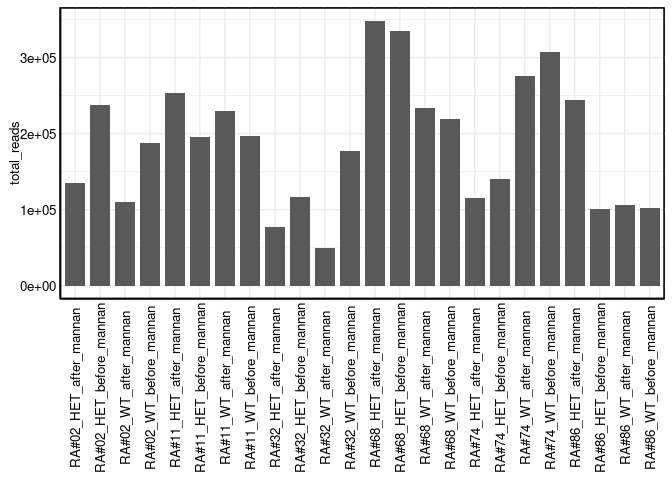<!-- -->

``` r
data$mean <- apply(data[,-1], 1, function(x) mean(x))
data <- data[order(data$mean, decreasing = TRUE),]

tax_names <- str_split(data$Taxa, ";", simplify = TRUE)

data$final_tax <- str_split(str_split(data$Taxa, ";f__", simplify= TRUE)[,2], ";", simplify = TRUE)[,1]
data$final_tax[data$final_tax == ""] <- "other"

data <- data[, c(1, ncol(data), 2:(ncol(data)-1))]

data <- data[, -ncol(data)]

data$final_tax <- str_replace(data$final_tax, "S24-7", "Muribaculaceae")
data$final_tax <- str_replace(data$final_tax, "Alcaligenaceae", "Sutterellaceae")

data_cor_df <- data

data$final_tax[25:nrow(data)] <- "other"
data_family <- aggregate(data[,c(-1, -2)], by = list(data$final_tax), sum)
data_family$Group.1 <- ordered(data_family$Group.1, levels = c(unique(data$final_tax)))

data_family$Group.1 <- ordered(data_family$Group.1, levels = c(unique(data$final_tax)[unique(data$final_tax) != "other"], "other"))

data$final_tax <- str_split(str_split(data$Taxa, ";g__", simplify= TRUE)[,2], ";", simplify = TRUE)[,1]
data$final_tax <- ifelse(data$final_tax == "", "other", data$final_tax)
data_genus <- aggregate(data[,c(-1, -2)], by = list(data$final_tax), sum)

data_genus[,-1] <- apply(data_genus[,-1], 2, function(x) x/sum(x))
```

### Generating bar plots of all mice fecal samples (Supp Fig 4)

``` r
temp <- melt(data_family)
```

    ## Using Group.1 as id variables

``` r
colnames(temp) <- c("Group.1", "sample-ID", "value")
temp <- merge(temp, metadata, by = "sample-ID", all.y = FALSE)
temp$BeforeAfterArthritisInd <- ordered(temp$BeforeAfterArthritisInd, levels = c("before_mannan", "after_mannan"))
temp <- temp[temp$MouseType == "HET",]
temp <- aggregate(temp[,c(3)], by = list(temp$PatientbeforeafterRA, temp$Group.1, temp$Patient, temp$Patient002086, temp$BeforeAfterArthritisInd), sum)


ggplot(temp, aes(x = Group.3, y = x, fill = Group.2)) + geom_bar(stat = "identity", position = "fill",width = 0.8) + 
  scale_fill_manual(values = family_cols) +
  facet_wrap(~Group.5, scales = "free_y" , nrow = 2) +
   theme(text = element_text(size = 15), axis.text.x = element_text(angle = 90)) + theme_boxp()
```

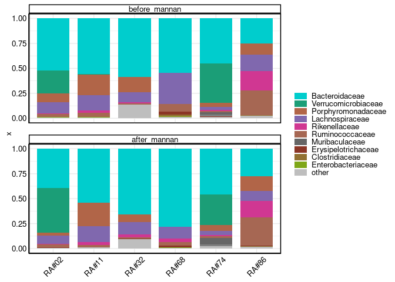<!-- -->

``` r


temp <- melt(data_family)
```

    ## Using Group.1 as id variables

``` r
colnames(temp) <- c("Group.1", "sample-ID", "value")
temp <- merge(temp, metadata, by = "sample-ID", all.y = FALSE)
temp$BeforeAfterArthritisInd <- ordered(temp$BeforeAfterArthritisInd, levels = c("before_mannan", "after_mannan"))
temp <- temp[temp$MouseType == "WT",]
temp <- aggregate(temp[,c(3)], by = list(temp$PatientbeforeafterRA, temp$Group.1, temp$Patient, temp$Patient002086, temp$BeforeAfterArthritisInd), sum)


ggplot(temp, aes(x = Group.3, y = x, fill = Group.2)) + geom_bar(stat = "identity", position = "fill",width = 0.8) + 
  scale_fill_manual(values = family_cols) +
  facet_wrap(~Group.5, scales = "free_y" , nrow = 2) +
   theme(text = element_text(size = 15), axis.text.x = element_text(angle = 90)) + theme_boxp()
```

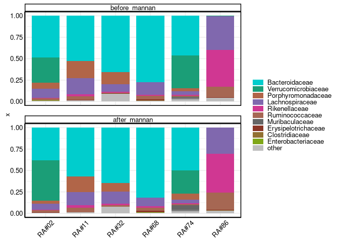<!-- -->

``` r

```

### Ratio of Bacteroides to Prevotella (Supp Fig 5)

``` r
temp <- data_genus[str_detect(data_genus$Group.1, "Prevotella|Bacteroides"),]
temp <- melt(temp)
```

    ## Using Group.1 as id variables

``` r
colnames(temp)[2] <- "sample-ID"


temp <- merge(temp, metadata[, c(1, 4, 12, 13:ncol(metadata))], by = "sample-ID")

temp <- aggregate(temp[, c(3)], by = list(temp$PatientTypebeforeafterRA, temp$Group.1), mean)


ggplot(temp, aes(x = Group.1, y = x, fill = Group.2)) + geom_bar(stat = "identity",width = 0.8) + 
  scale_fill_manual(values = c("Bacteroides"="cyan3", "Prevotella"="coral")) +
  coord_flip() + 
  ylim(0,1) +
   theme_boxp() + theme(text = element_text(size = 15), axis.text.x = element_text(angle = 0), axis.title.y = element_blank(), legend.position = "none")
```

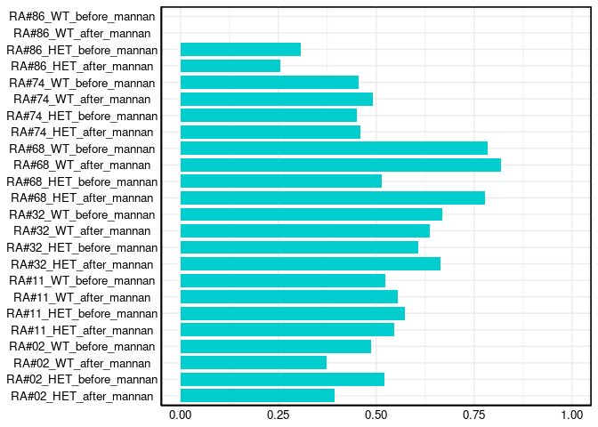<!-- -->

``` r


ggplot(temp[str_detect(temp$Group.1, "RA#86"),], aes(x = Group.1, y = x, fill = Group.2)) + geom_bar(stat = "identity",width = 0.8) + 
  scale_fill_manual(values = c("Bacteroides"="cyan3", "Prevotella"="coral")) +
  coord_flip() +
  ylim(NA, 0.001) +
   theme_boxp() + theme(text = element_text(size = 15), axis.text.x = element_text(angle = 90), axis.title.y = element_blank(), legend.position = "none")
```

    ## Warning: Removed 2 rows containing missing values (`position_stack()`).

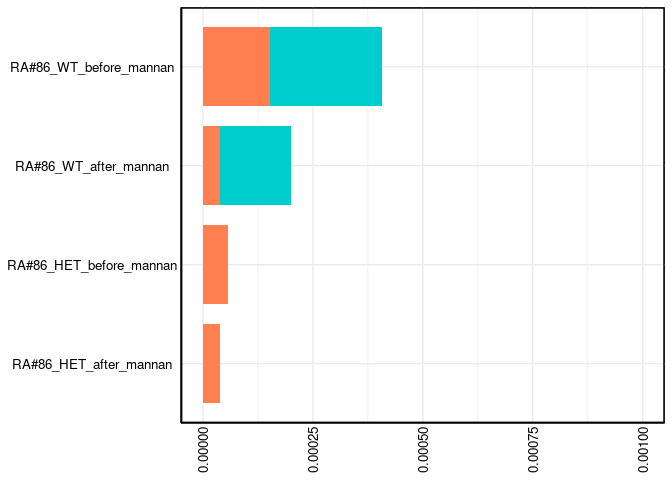<!-- -->

``` r

ggplot(temp[str_detect(temp$Group.1, "RA#02"),], aes(x = Group.1, y = x, fill = Group.2)) + geom_bar(stat = "identity",width = 0.8) + 
 scale_fill_manual(values = c("Bacteroides"="cyan3", "Prevotella"="coral")) +
  coord_flip() +
  ylim(NA, 0.001) +
   theme_boxp() + theme(text = element_text(size = 15), axis.text.x = element_text(angle = 90), axis.title.y = element_blank(), legend.position = "none")
```

    ## Warning: Removed 4 rows containing missing values (`position_stack()`).

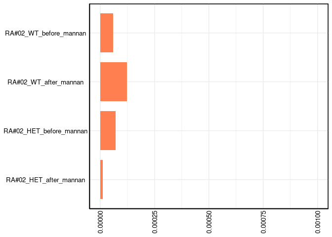<!-- -->

``` r

```

### PERMANOVA of the clustering by Patient, Mouse Genotype.

``` r
dist <- read.delim("/media/deepan/Deepan/RA_Bottini/final_merged_tables_forwardonly/afterFMT/distance-matrix.tsv", header = TRUE, sep = "\t", check.names = FALSE, row.names = 1)

dispersion_test <- betadisper(as.dist(dist), metadata[metadata$`sample-ID` %in% rownames(dist), c(1, 4, 10)]$Patient)
permutest(dispersion_test, permutations = 999)
```

    ## 
    ## Permutation test for homogeneity of multivariate dispersions
    ## Permutation: free
    ## Number of permutations: 999
    ## 
    ## Response: Distances
    ##            Df Sum Sq Mean Sq      F N.Perm Pr(>F)    
    ## Groups      5 23.878  4.7755 18.581    999  0.001 ***
    ## Residuals 119 30.584  0.2570                         
    ## ---
    ## Signif. codes:  0 '***' 0.001 '**' 0.01 '*' 0.05 '.' 0.1 ' ' 1

``` r
#dispersion due to Patient is high, so this means that the data is not homogeneously distributed. PERMANOVA of clustering by Patient group may be biased. Report with PERMDISP results. 

boxplot(dispersion_test)
```

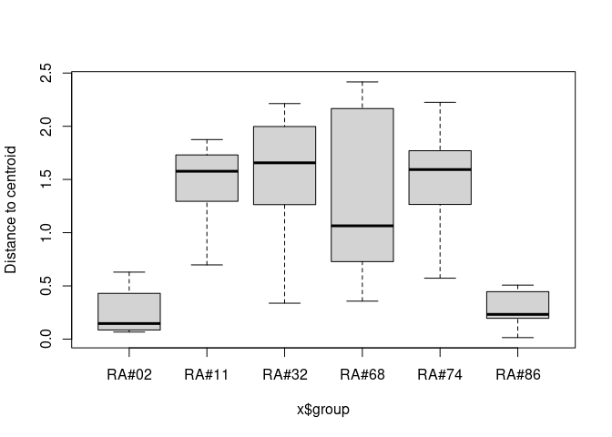<!-- -->

``` r
dispersion_test_B <- betadisper(as.dist(dist), metadata[metadata$`sample-ID` %in% rownames(dist), c(1, 4, 11)]$MouseType)
permutest(dispersion_test_B, permutations = 9999)
```

    ## 
    ## Permutation test for homogeneity of multivariate dispersions
    ## Permutation: free
    ## Number of permutations: 9999
    ## 
    ## Response: Distances
    ##            Df Sum Sq Mean Sq      F N.Perm Pr(>F)  
    ## Groups      1  1.073 1.07328 3.2244   9999 0.0713 .
    ## Residuals 123 40.942 0.33286                       
    ## ---
    ## Signif. codes:  0 '***' 0.001 '**' 0.01 '*' 0.05 '.' 0.1 ' ' 1

``` r
#MouseType within-group dispersion seems good. 
boxplot(dispersion_test_B)
```

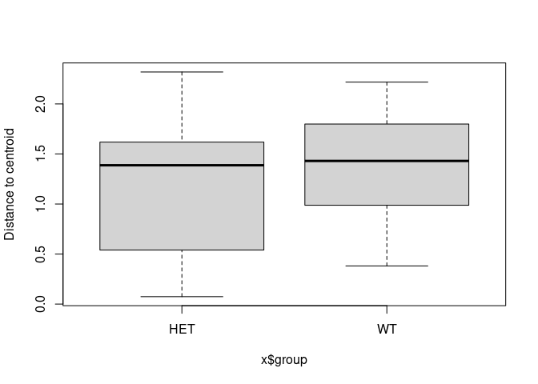<!-- -->

``` r
adonis2(as.dist(dist)~Patient+MouseType, data = metadata[metadata$`sample-ID` %in% rownames(dist), c(1, 4, 6, 11)], permutations = 9999)
```

    ## Permutation test for adonis under reduced model
    ## Terms added sequentially (first to last)
    ## Permutation: free
    ## Number of permutations: 9999
    ## 
    ## adonis2(formula = as.dist(dist) ~ Patient + MouseType, data = metadata[metadata$`sample-ID` %in% rownames(dist), c(1, 4, 6, 11)], permutations = 9999)
    ##            Df SumOfSqs      R2      F Pr(>F)
    ## Patient     5    9.073 0.03616 0.8997 0.5416
    ## MouseType   1    3.853 0.01535 1.9103 0.1539
    ## Residual  118  237.981 0.94848              
    ## Total     124  250.906 1.00000

``` r
##Performed PERMANOVA of clustering by Mouse Genotype with strata set to Patient to account for high within-group dispersion.  

adonis2(as.dist(dist)~MouseType, data = metadata[metadata$`sample-ID` %in% rownames(dist), c(1, 4, 6, 11)], strata = metadata[metadata$`sample-ID` %in% rownames(dist), c(1, 4, 6, 11)]$Patient, permutations = 9999)
```

    ## Permutation test for adonis under reduced model
    ## Terms added sequentially (first to last)
    ## Blocks:  strata 
    ## Permutation: free
    ## Number of permutations: 9999
    ## 
    ## adonis2(formula = as.dist(dist) ~ MouseType, data = metadata[metadata$`sample-ID` %in% rownames(dist), c(1, 4, 6, 11)], permutations = 9999, strata = metadata[metadata$`sample-ID` %in% rownames(dist), c(1, 4, 6, 11)]$Patient)
    ##            Df SumOfSqs      R2      F Pr(>F)  
    ## MouseType   1     4.95 0.01973 2.4754 0.0862 .
    ## Residual  123   245.96 0.98027                
    ## Total     124   250.91 1.00000                
    ## ---
    ## Signif. codes:  0 '***' 0.001 '**' 0.01 '*' 0.05 '.' 0.1 ' ' 1

``` r
# effect of Genotype on sample clustering within each Patient group

group_permanova <- function(p){

  metadata_sub <- metadata %>%
    filter(Patient == p) %>% 
    filter(samplename %in% rownames(dist)) %>%
    filter(BeforeAfterArthritisInd == "after_mannan")
  
  samples <- metadata_sub$samplename
  
  dist_sub <- dist[samples, samples]
  
  temp <- adonis2(as.dist(dist_sub)~MouseType, data = metadata_sub, permutations = 999)
  
  return(data.frame(Patient = p, F_stat = temp$F[1], p_val = temp$`Pr(>F)`[1]))
  

}

genotype_df <- bind_rows(lapply(unique(metadata$Patient[!metadata$Patient %in% c("RA#26", "")]), group_permanova))
```

    ## 'nperm' >= set of all permutations: complete enumeration.

    ## Set of permutations < 'minperm'. Generating entire set.

    ## 'nperm' >= set of all permutations: complete enumeration.

    ## Set of permutations < 'minperm'. Generating entire set.

    ## 'nperm' >= set of all permutations: complete enumeration.

    ## Set of permutations < 'minperm'. Generating entire set.

``` r
genotype_df$Patient <- factor(genotype_df$Patient, levels = genotype_df$Patient[order(genotype_df$F_stat)])

ggplot(genotype_df, aes(x = Patient, y = F_stat)) +
  geom_bar(stat = "identity", fill = "steelblue") +
  geom_text(aes(label = round(p_val, 2)), vjust = -0.5, size = 3.5) +
  theme_minimal() +
  labs(title = "PERMANOVA F-statistics by Patient",
       y = "F-statistic (Effect size of Mouse Genotype)",
       x = "Patient") +
  theme(axis.text.x = element_text(angle = 45, hjust = 1))
```

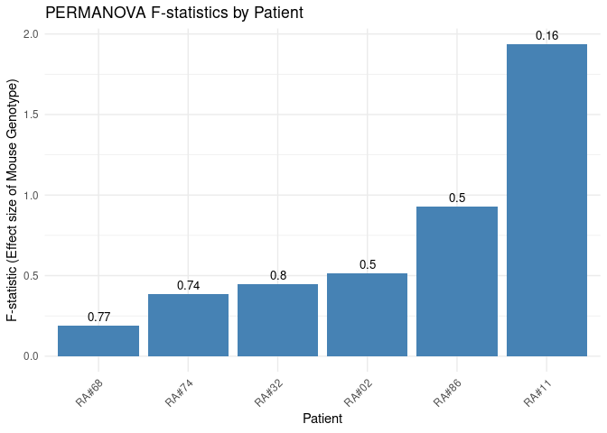<!-- -->

``` r

```

### Correlation of fold-change of taxa from pre- to post-arthritis_induction against cellular phenotypes

``` r
joint_scores <- read.delim("/media/deepan/Deepan/RA_Bottini/joint_scores_sho_mice.csv", header = TRUE, sep = ",", check.names = FALSE)

joint_scores$MouseID <- paste(joint_scores$MouseID, joint_scores$microbiome, sep = "_")


metadata_scores <- metadata %>%
  mutate(Patient = str_replace(Patient, "#", "0")) %>%
  mutate(MouseID = ifelse(OriginalFecal == "no", paste(MouseID, Patient, sep = "_"), MouseID)) %>%
  filter(BeforeAfterArthritisInd == "after_mannan") %>%
  left_join(., joint_scores[, !colnames(joint_scores)%in% c("microbiome", "genotype")], by = "MouseID") %>%
  mutate(cartilage_depletion.y = ifelse(is.na(cartilage_depletion.y), cartilage_depletion.x, cartilage_depletion.y)) %>%
  select(-ends_with(".x")) 

metadata_scores <- metadata_scores%>%
  mutate(Patient = str_replace(Patient, "A0", "A#")) %>%
  mutate(MouseID = str_replace(MouseID, "A0", "A#"))


metadata_0286 <- metadata_scores %>%
  filter(Total_Cells != "") %>%
  filter(Patient == c("RA#02", "RA#86")) %>%
  select(MouseID, MouseType, Total_Cells, `CD4+`, total_Tregs, `RORgt+Treg`, `CD4+RORgt+Foxp3-`, Flow_values_ankle, Ankle_swelling, cartilage_depletion.y, inflammation, bone_resorption)

#correlation df for mice 086 and 02 patients only. 

data_cor_df_rel <- data_cor_df
data_cor_df_rel[, -1:-2] <- apply(data_cor_df_rel[,-1:-2], 2, function(x) x/sum(x))
data_cor_df_rel <- aggregate(data_cor_df_rel[, -1:-2], by = list(data_cor_df_rel$Taxa, data_cor_df_rel$final_tax), sum)
colnames(data_cor_df_rel)[1:2] <- c("Taxa", "final_tax")

genus_scores <- data_cor_df_rel %>%
  pivot_longer(cols = starts_with("B-"), names_to = "sample-ID", values_to = "rel_abund") %>%
  inner_join(., metadata, by = "sample-ID") %>%
  select(Taxa, final_tax, rel_abund, MouseID, BeforeAfterArthritisInd, Patient) %>%
  #filter(Patient == c("RA#02", "RA#86")) %>%
  group_by(Taxa, MouseID) %>%
  pivot_wider(names_from = BeforeAfterArthritisInd, values_from = rel_abund) %>%
  na.omit() %>% #get rid of any rows with NA
  mutate(fold_change = log2(after_mannan / before_mannan)) %>%
  mutate(MouseID = paste(MouseID, Patient, sep = "_")) %>%
  inner_join(., metadata_scores, by = "MouseID") %>%
  mutate_at(vars(Total_Cells, `CD4+`, total_Tregs, `RORgt+Treg`, `CD4+RORgt+Foxp3-`, Flow_values_ankle, Ankle_swelling, cartilage_depletion.y),  as.numeric) 

correlation_results <- genus_scores %>%
  select(-Patient.x, -before_mannan, -inflammation, -bone_resorption) %>%
  pivot_longer(cols = c(Total_Cells, `CD4+`, total_Tregs, `RORgt+Treg`, `CD4+RORgt+Foxp3-`, Flow_values_ankle, Ankle_swelling, cartilage_depletion.y), names_to = "Phenotype", values_to = "Value") %>%
  group_by(Taxa, MouseType, Phenotype) %>%
  na.omit() %>%
  filter(!is.infinite(fold_change)) %>%
  group_split() %>%
  map_dfr(~ {
    if (nrow(.x) < 3) return(NULL) #at least three groups to compute correlation and std deviation
    cor_test <- suppressWarnings(cor.test(.x$fold_change, .x$Value, method = "spearman")) # supressing warning regaridng computation of exact p-value with ties.
    tibble(
      Taxa = unique(.x$Taxa),
      Family = unique(.x$final_tax),
      Phenotype = unique(.x$Phenotype),
      MouseType = unique(.x$MouseType),
      rel_abund = mean(.x$after_mannan),
      estimate = cor_test$estimate,
      statistic = cor_test$statistic,
      p.value = p.adjust(cor_test$p.value, method = "fdr")
    )
  }) %>%
  mutate(Phenotype = str_replace(Phenotype, ".y", ""))

unique(data_cor_df_rel$Group.1)
```

    ## NULL

``` r
volcano_data <- correlation_results %>%
  na.omit() %>%
  mutate(genus = str_split(str_split(Taxa, ";g__", simplify = TRUE)[, 2], ";s", simplify = TRUE)[,1]) %>%
  mutate(label = ifelse(p.value < 0.05 & abs(estimate) > 0.5, as.character(genus), NA)) %>%
  mutate(alpha_scaled = ifelse(rel_abund < 0.1, 0.2, rel_abund))

plots <- volcano_data %>%
  split(.$Phenotype) %>%
  map(~ {
    ggplot(.x, aes(x = estimate, y = -log10(p.value))) +
  # Add points with black border and variable size based on label presence
  geom_point(aes(color = p.value < 0.05 & abs(estimate) > 0.5, shape = MouseType, alpha = alpha_scaled), 
             size = ifelse(!is.na(.x$label), 4, 2),  # Larger if labeled
             stroke = 1.5) +  # Black outline
 geom_text_repel(aes(label = label), 
                  size = 5, 
                  max.overlaps = 50,  # Allows more label overlap if needed
                  box.padding = 0.35, 
                  point.padding = 0.5,
                  segment.size = 0.5) +
  
  # Customize color scale
  scale_color_manual(values = c("gray60", "firebrick")) +
  scale_alpha_continuous(range = c(0.2, 1)) +
  
  # Title, labels
  labs(title = unique(.x$Phenotype),
       x = "Spearman Estimate (rho)",
       y = "-log10(p-value)",
       color = "p.value < 0.05 & rho > 0.5") +
  
  
  # Add borders to plot
  theme_minimal() +
  theme(
    panel.border = element_rect(color = "black", fill = NA, size = 1),  # Border around the plot
    panel.grid = element_blank(),  # Remove grid lines
    #axis.line = element_line(size = 1),  # Make axis lines thicker
    axis.text = element_text(size = 12),  # Size of axis labels
    axis.title = element_text(size = 14),  # Title size
    plot.margin = margin(1, 1, 1, 1),
    plot.background = element_rect(color = "white")
  )
  })


plots
```

    ## $Ankle_swelling

    ## Warning: Removed 49 rows containing missing values (`geom_text_repel()`).

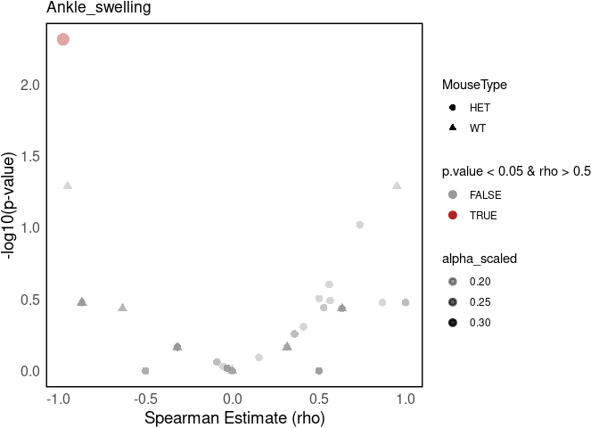<!-- -->

    ## 
    ## $cartilage_depletion

    ## Warning: Removed 107 rows containing missing values (`geom_text_repel()`).

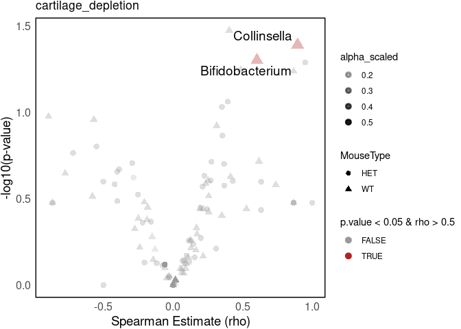<!-- -->

    ## 
    ## $`CD4+`

    ## Warning: Removed 108 rows containing missing values (`geom_text_repel()`).

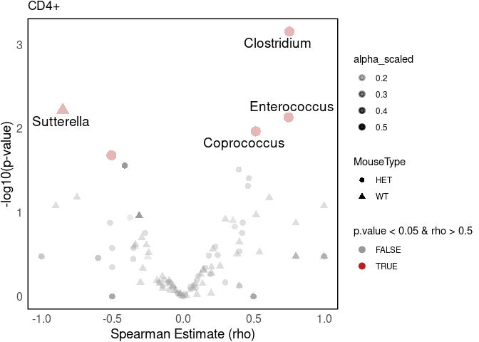<!-- -->

    ## 
    ## $`CD4+RORgt+Foxp3-`

    ## Warning: Removed 109 rows containing missing values (`geom_text_repel()`).

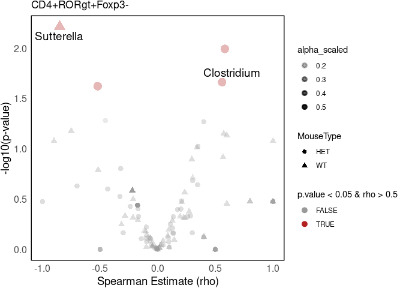<!-- -->

    ## 
    ## $Flow_values_ankle

    ## Warning: Removed 50 rows containing missing values (`geom_text_repel()`).

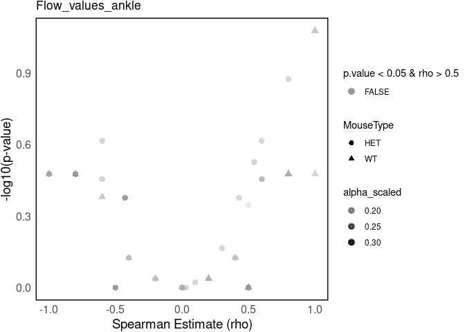<!-- -->

    ## 
    ## $`RORgt+Treg`

    ## Warning: Removed 111 rows containing missing values (`geom_text_repel()`).

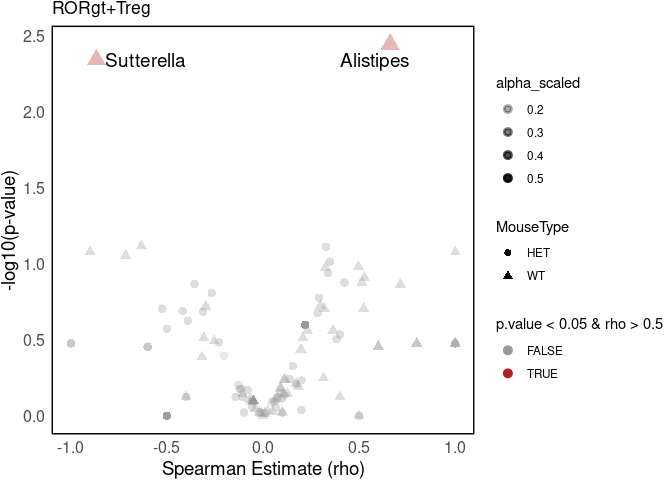<!-- -->

    ## 
    ## $Total_Cells

    ## Warning: Removed 107 rows containing missing values (`geom_text_repel()`).

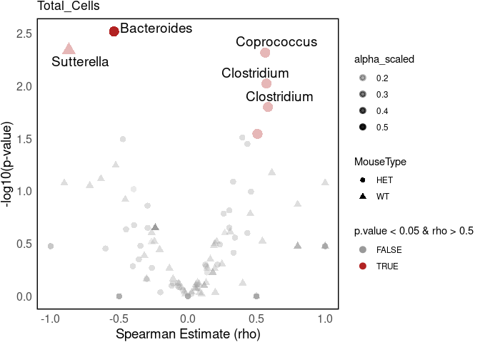<!-- -->

    ## 
    ## $total_Tregs

    ## Warning: Removed 109 rows containing missing values (`geom_text_repel()`).

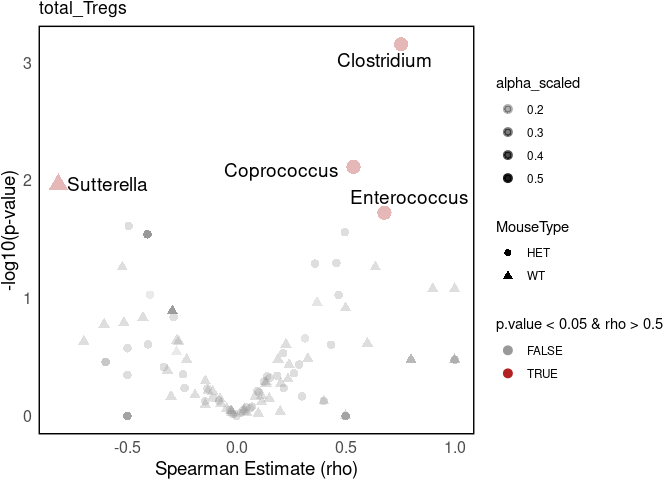<!-- -->

``` r


## Correlation coefficient (estimate) and p-value for Bacteroides genera against Total Cell counts. 

correlation_results %>%
  filter(str_detect(Taxa, "Bacteroides")) %>%
  filter(Phenotype == "Total_Cells") %>%
  arrange(-rel_abund, -estimate)
```

    ## # A tibble: 2 × 8
    ##   Taxa           Family Phenotype MouseType rel_abund estimate statistic p.value
    ##   <chr>          <chr>  <chr>     <chr>         <dbl>    <dbl>     <dbl>   <dbl>
    ## 1 k__Bacteria;p… Bacte… Total_Ce… HET           0.561   -0.538      6244 0.00301
    ## 2 k__Bacteria;p… Bacte… Total_Ce… WT            0.547   -0.238      4522 0.223
